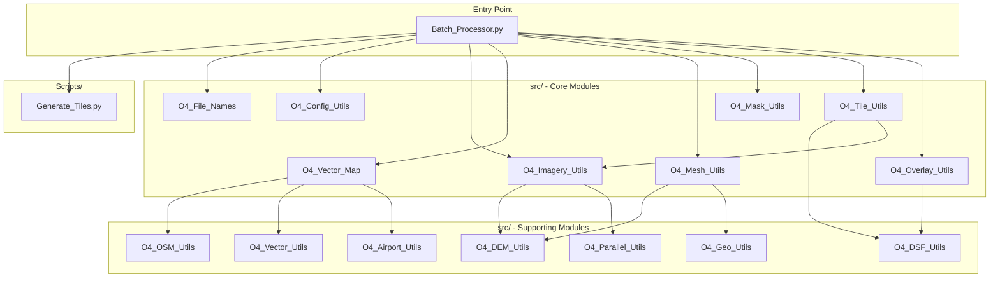
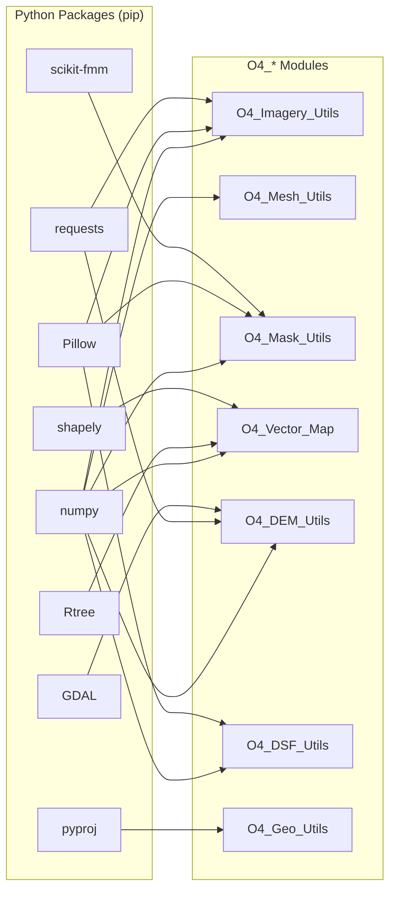
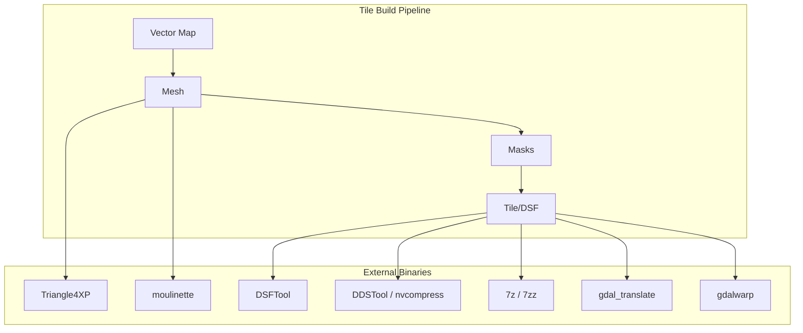

# Batch_Processor.py Dependencies

Complete dependency map for running `Scripts/Batch_Processor.py`.

## Module Dependency Graph



## Python Package Dependencies



| Package | Version | Used By | Purpose |
|---------|---------|---------|---------|
| numpy | 1.26.4 | All modules | Array operations, mesh data |
| Pillow | 12.0.0 | IMG, MASK, DSF | Image processing, DDS conversion |
| pyproj | 3.7.2 | GEO | Coordinate transformations |
| requests | 2.32.5 | IMG, DEM, OSM | HTTP downloads |
| Rtree | 1.4.1 | VMAP, VEC | Spatial indexing |
| shapely | 2.1.2 | VMAP, VEC, APT | Vector geometry operations |
| scikit-fmm | 2025.6.23 | MASK | Fast marching for water masks |
| GDAL | 3.9.0-3.11.4* | DEM, IMG | Geospatial raster operations |

*GDAL version is platform-dependent (see below)

## External Tools & Binaries



| Tool | Location | Platform | Purpose |
|------|----------|----------|---------|
| Triangle4XP | `Utils/{platform}/` | All | Constrained Delaunay mesh generation |
| moulinette | `Utils/{platform}/` | All | Mesh triangle sorting for DSF |
| DSFTool | `Utils/{platform}/` | All | DSF text/binary conversion |
| DDSTool | `Utils/mac/` | macOS | PNG → DDS texture compression |
| nvcompress | `Utils/{win,lin}/` | Win/Linux | PNG → DDS texture compression |
| 7z / 7zz | `Utils/{platform}/` or system | All | Archive extraction |
| gdal_translate | System PATH | All | GeoTIFF georeferencing |
| gdalwarp | System PATH | All | Image reprojection |

## System Dependencies

### macOS (Homebrew)

```bash
brew install python python-tk spatialindex p7zip proj gdal
```

| Package | Purpose |
|---------|---------|
| python | Python 3.x interpreter |
| python-tk | Tkinter GUI framework |
| spatialindex | Required by Rtree |
| p7zip | 7-zip archive support |
| proj | PROJ coordinate library |
| gdal | GDAL/OGR geospatial library |

### Windows

All dependencies bundled in `Utils/win/`:
- Pre-built wheel files (`.whl`) for pip packages
- Compiled binaries (`.exe`, `.dll`)

### Linux

```bash
# Debian/Ubuntu
apt install python3 python3-tk libspatialindex-dev p7zip-full libproj-dev libgdal-dev

# pip packages
pip install numpy pillow pyproj requests Rtree shapely scikit-fmm gdal
```

## Platform Compatibility Matrix

| Component | macOS | Windows | Linux |
|-----------|-------|---------|-------|
| **Python** | 3.11+ | 3.11+ | 3.11+ |
| **GDAL version** | 3.11.4 | 3.11.1 | 3.9.0 |
| **DDS converter** | DDSTool | nvcompress | nvcompress |
| **7-zip binary** | 7zz | 7z.exe | 7z |
| **Install method** | Homebrew + pip | Bundled wheels | apt + pip |
| **Triangle4XP** | `Utils/mac/` | `Utils/win/` | `Utils/lin/` |

## Build Dependencies (Optional)

Only needed to recompile `Utils/src/` binaries:

```bash
# Build Triangle4XP and moulinette from source
cd Utils
cmake .
make
```

| Tool | Purpose |
|------|---------|
| CMake | Build system generator |
| C compiler (gcc/clang) | Compile Triangle4XP.c |

## Quick Start

```bash
# 1. Install system dependencies (macOS example)
brew install python python-tk spatialindex p7zip proj gdal

# 2. Create virtual environment
python3 -m venv venv
source venv/bin/activate

# 3. Install Python packages
pip install -r requirements.txt

# 4. Run batch processor
python Scripts/Batch_Processor.py --config batch_config.toml
```
